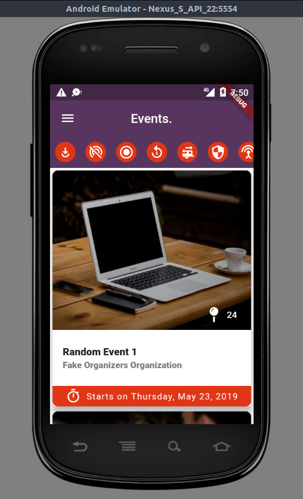
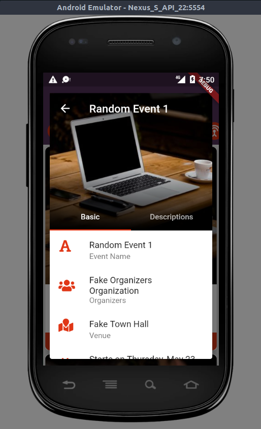
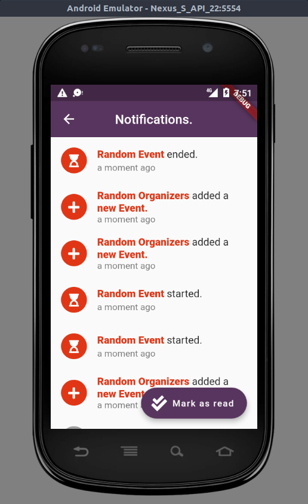
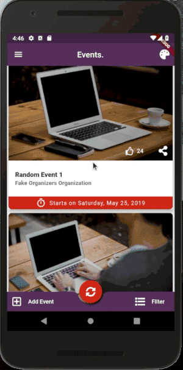
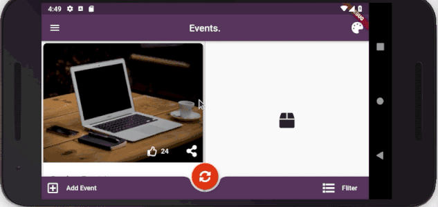

# EVENTS

Events App to subscribe and receive event data.

|  |  |  |
| ---------------------------------------- | ---------------------------------------- | ---------------------------------------- |
| Home Page                                | Event Details Page                       | Notifications Page                       |

## Checklist

- [x] Add Theme handling
- [x] Add Both mobile and tablet modes
- [ ] Add subscribe to feed UI

## Landscape/Portrait Views

|  |    |
| -------------------------------------- | -------------------------------------- |
|Mobile View| Tablet View |

## How to Run

```bash
flutter run
```

